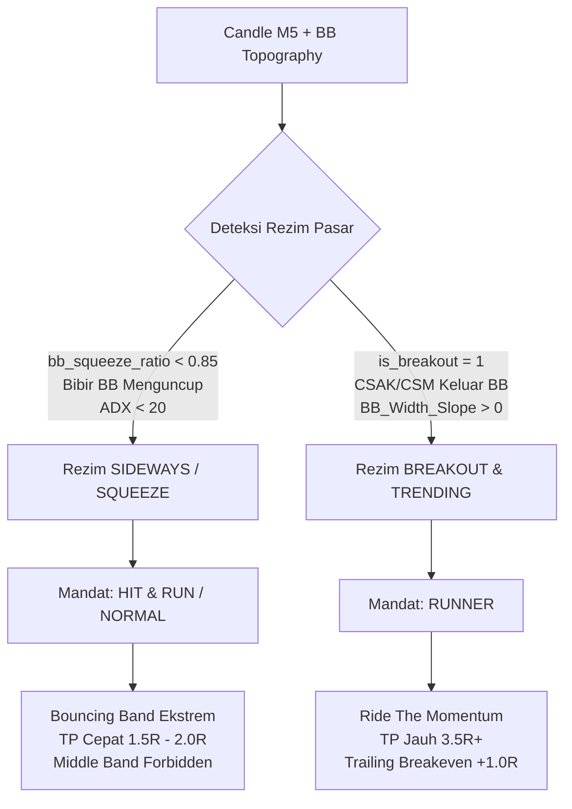

# Technical Debt: Regime-Specialized Dual Agents (Hit & Run vs Runner)

**Tanggal Dibuat:** 01 Oktober 2026  
**Status:** IMPLEMENTED / RESOLVED (Selesai Diterapkan ke Codebase)  
**Prioritas:** HIGH (Kritikal untuk kelulusan Fit & Proper Test Model AI)  
**Terkait Modul:**  
- `backend/agents/research/target_labeler.py`
- `backend/agents/research/oos_evaluator.py`
- `backend/agents/research/feature_engineer.py`
- `backend/agents/executor.py`
- `backend/agents/research/profiles/`

---

## 1. Latar Belakang & Pernyataan Masalah (Problem Statement)

Trading BOT dirancang dengan arsitektur dua model AI terpisah:
1. **Mode Normal (Hit & Run):** Ditujukan untuk menangkap pergerakan cepat pada pasar berkonsolidasi (*sideways / ranging*).
2. **Mode Runner:** Ditujukan untuk menangkap pergerakan gelombang besar saat terjadi penembusan struktur (*break of structure / breakout*) dan tren mengembang (*running trend*).

### Masalah Saat Ini (Core Debt):
Saat ini, kedua model dilatih (*trained*) dan diuji (*OOS evaluation*) pada **seluruh bar data secara homogen tanpa partisi rezim pasar (Regime Coupling)**:
- **Runner dipaksa bertarung di pasar Sideways:** Target Runner adalah Risk:Reward $\ge 1:3.5$. Pada pasar sideways yang sempit (lebar band 20–30 pips), harga secara fisik tidak mungkin mencapai 3.5R. Posisi floating $+1.0\text{R}$ s.d. $+1.5\text{R}$ tidak pernah ditutup (*take profit*), lalu berbalik arah (*reversal*) memantul ke band seberang dan terhenti di Stop Loss/Breakeven. Akibatnya, Win Rate Runner terpuruk di ~31% dan Profit Factor di ~0.60x.
- **Hit & Run bertarung di pasar Trending Kuat:** Model Hit & Run keluar terlalu dini ($\text{RR } 1:1.5 - 2.0$) di awal gelombang besar atau mengambil risiko pembalikan prematur.
- **Simulasi OOS VectorBT Tidak Menghormati Habitat:** Evaluator OOS menguji Runner di 50.000 candle termasuk era sideways berbulan-bulan, sehingga statistik kelulusan model institusional (*Fit & Proper Test*) selalu gagal.

---

## 2. Arsitektur Solusi Target: Dynamic Regime Hand-off

---

## 3. Komponen Technical Debt & Status Eksekusi

### Item 1: Partisi Rezim pada Pelabelan Target (`target_labeler.py`) — [x] SELESAI
- `Target_Normal (Hit & Run)`: HANYA dilabeli positif ($=1$) jika candle berada di rezim **Sideways / Squeeze / Reversal Ekstrem** (`is_normal_habitat`).
- `Target_Runner`: HANYA dilabeli positif ($=1$) jika candle berada di rezim **Breakout & Trending** (`is_runner_habitat`). Bar di dalam sideways mati **dilarang dilabeli sebagai setup Runner**.

---

### Item 2: Partisi Rezim pada Ujian OOS VectorBT (`oos_evaluator.py`) — [x] SELESAI
- Saat `mode == "runner"`: Sinyal OOS **hanya aktif pada bar yang teridentifikasi Breakout / Trending** (`runner_regime_mask`).
- Saat `mode == "normal"`: Sinyal OOS difokuskan pada bar Sideways / Ranging / Konsolidasi (`normal_regime_mask`).

---

### Item 3: Estafet Rezim Otomatis di Live Execution (`executor.py`) — [x] SELESAI
- State Machine Estafet diimplementasikan:
  - Jika pasar berada dalam `is_bb_squeeze`: Agen Hit & Run yang mengambil mandat kendali (*"Sideways nih, giliran gua"*).
  - Begitu muncul candle CSAK/CSM menembus BB Squeeze (`is_breakout_bull/bear == 1`): Tongkat estafet langsung diserahkan ke Agen Runner (*"Trend sudah jalan, giliran gua"*).
  - Runner terlindungi dari eksekusi di dalam fase squeeze mati.

---

### Item 4: Optimasi Fitur & Kalibrasi Threshold Terpisah (`optimizer.py` & `calibrator.py`) — [x] SELESAI
- Kalibrasi threshold probabilitas Runner difilter khusus pada habitat Breakout & Trending.
- Evaluasi Optuna objective difilter khusus pada habitat mode masing-masing.

---

## 4. Matriks Dampak & Risiko (Impact & Risk Matrix)

| Aspek | Sebelum Perbaikan | Setelah Perbaikan (Target) |
|---|---|---|
| **Win Rate Runner (OOS)** | 31.1% (Gagal) | $\ge 40.0\%$ (Lolos kriteria $\ge 28\%$) |
| **Profit Factor Runner (OOS)** | 0.60x (Gagal) | $\ge 1.40\text{x}$ (Target $\ge 1.20\text{x}$) |
| **Max Drawdown Runner (OOS)** | 34.3% (Tinggi) | $\le 15.0\%$ (Limit toleransi $\le 35\%$) |
| **Jumlah Trade Runner (OOS)** | 1.743 trades (Overtrading) | 120 – 250 trades berkualitas tinggi |
| **Perilaku Live Execution** | Saling tumpang tindih & counter-trend | Hand-off estafet bersih & terisolasi |

---

## 5. Kriteria Penerimaan (Acceptance Criteria)

1. [x] `target_labeler.py` tidak memberikan `Target_Runner = 1` pada candle yang berada di dalam BB Squeeze murni tanpa breakout.
2. [x] `oos_evaluator.py` saat mode `runner` mengevaluasi hanya pada habitat Breakout & Trending (`runner_regime_mask`).
3. [x] `executor.py` mencatat log transisi estafet rezim secara transparan: `[REGIME HAND-OFF] Pasar BREAKOUT & TRENDING: Mandat dipegang RUNNER`.
4. [x] `optimizer.py` dan `calibrator.py` menerapkan filter habitat rezim saat evaluasi Optuna dan pencarian threshold.
5. [x] Dokumen [rule.md](file:///d:/Titip/Dulinan/Trading%20BOT/rule.md) diperbarui mencerminkan aturan estafet dua rezim pasar.
